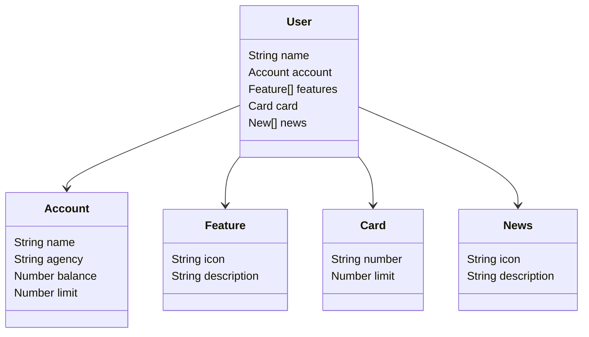

# Projeto de conta bancaria com SpringBoot

### Diagrama de classes

```mermaid

classDiagram
class User{
    String name
    Account account
    Feature[] features
    Card card
    New[] news
}
class Account{
    String name
    String agency
    Number balance
    Number limit
}
class Feature{
    String icon
    String description
}
class Card{
    String number
    Number limit
}
class News{
    String icon
    String description
}

User --> Account
User --> Feature
User --> Card
User --> News

```
